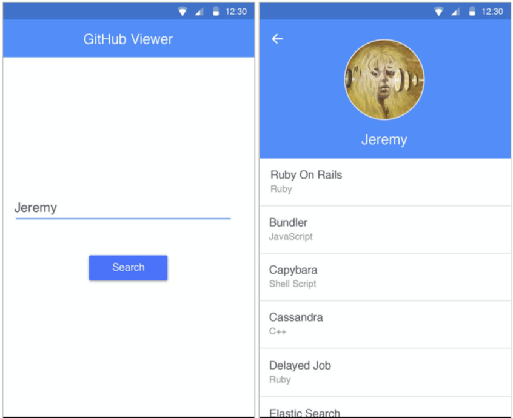
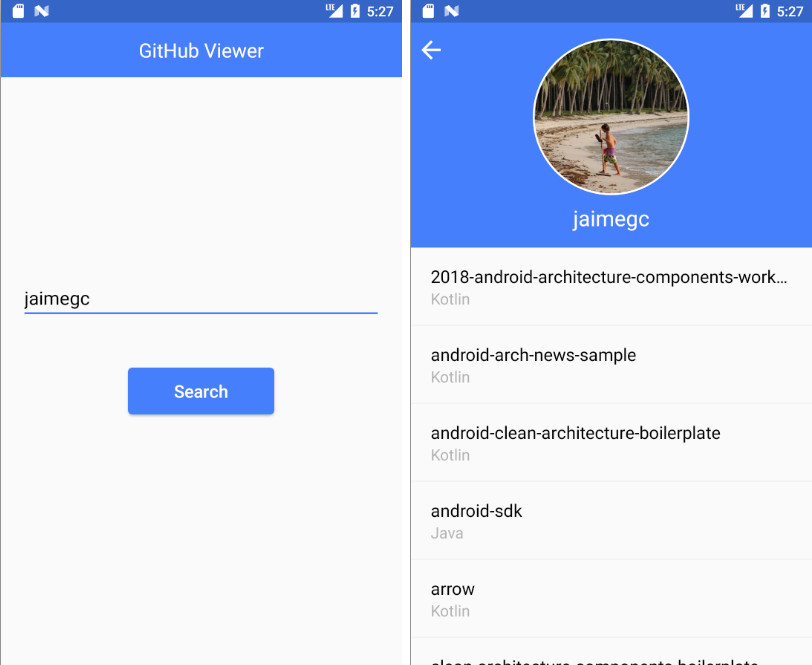
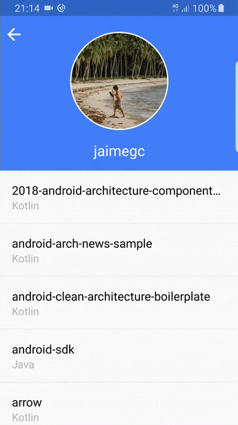

# Agile Android Developer Challenge

## Objective

Develop a native application, Android or iOS, which will allow the user to search and display a GitHub profile. Including the profile name, photo, repositories and their programming languages.

The API for making calls is available at the following URL: https://api.github.com/users/[username]/repos

## Features

* <b>Home screen: </b>Composed of a text box, where the profile name should be entered, and a button to perform the search, whose result should be displayed in the profile detail screen.
* <b>Profile detail: </b>This screen should display the profile name and photo (if it is found) and a list with all its the repositories. This list should present the name of the repository and, in the subtitle of each item, its programming language. A back button should allow you to return to the home screen to perform a new search.
* <b>Error handling: </b>When any error occurs in the API call, the following message should be displayed: "A network error has occurred. Check your Internet connection and try again later.". This message should have an "OK" button that just closes it.
* <b>User not found: </b>If a user is not found, display the following message: "User not found. Please enter another name.". This message should have an "OK" button that just closes it.

## Requirements

* The application should be developed using the native tools, Android Studio + Kotlin.
* Follow as closely as possible the reference layout provided in this document.
* Layout should fit any screen size, including tablet. For this it is enough to maintain the alignment of the elements.
* You can use any library to build the application, Retrofit, Picasso and etc.

## Considerations

In addition to the implementation of all functionalities and requirements, the following aspects of the solution will be taken into account:

* Clarity and organization of the code and files.
* Testability.
* Maintainability.
* Performance.
* It is expected a "production level" quality, something you consider good enough to release in production.

## Android Reference

  

# My Solution 👨🏽‍💻

The idea is complete this challenge on a couple of afternoons more or less. In this project you will see:

    Clean Architecture with MVP
    Kodein for DI
    Coroutines for network requests
    Either instead of exceptions
    Animations using MotionLayout and MotionScene
    Kotlin extensions for views, activities, images, etc.
    BetterAdapter to draw list items
    Unit testing for presenter and repository

There is a branch called <b>mvp-new-way</b> that uses another way to implement the repository and datasources. Moreover, the new retrofit version 2.6.0 is used to add <i>suspend</i> functions and remove <i>Deferred</i> calls.

## Screens

### Main & Detail

  

### Animations

  

## Developed By

Jaime GC

## Libraries used in this project

* [Arrow Either][1]
* [Coroutines][2]
* [Kodein][3]
* [Retrofit][4]
* [Picasso][5]
* [Mockito][6]
* [Mockito Kotlin][7]
* [OkHttp][8]
* [CircleImageView][9]

## Attributions

* [Karumi][10] for their amazing GitHub [repos][11]
* [47 Degrees][12] because I ❤️ [Either][1] and [Arrow][13]

License
-------

    Copyright 2019 Jaime GC
    Licensed under the Apache License, Version 2.0 (the "License");
    you may not use this file except in compliance with the License.
    You may obtain a copy of the License at

       http://www.apache.org/licenses/LICENSE-2.0

    Unless required by applicable law or agreed to in writing, software
    distributed under the License is distributed on an "AS IS" BASIS,
    WITHOUT WARRANTIES OR CONDITIONS OF ANY KIND, either express or implied.
    See the License for the specific language governing permissions and
    limitations under the License.    
    
[1]: https://arrow-kt.io/docs/arrow/core/either/
[2]: https://github.com/Kotlin/kotlinx.coroutines
[3]: https://github.com/Kodein-Framework/Kodein-DI
[4]: https://github.com/square/retrofit
[5]: https://github.com/square/picasso
[6]: https://github.com/mockito/mockito
[7]: https://github.com/nhaarman/mockito-kotlin
[8]: https://square.github.io/okhttp/
[9]: https://github.com/hdodenhof/CircleImageView
[10]: https://www.karumi.com/
[11]: https://github.com/Karumi
[12]: https://www.47deg.com/
[13]: https://github.com/arrow-kt/arrow
